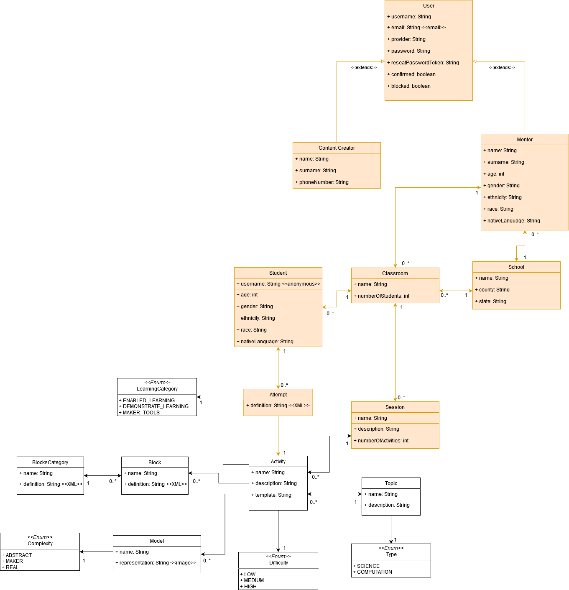

# Cms

> REST API and admin portal that comprise the backend. It is powered by [Node](https://nodejs.org/en/), [Strapi](https://strapi.io/documentation/3.0.0-beta.x/getting-started/introduction.html), and [PostgreSQL](https://www.postgresql.org/). The file structure is defined by Strapi and is documented [here](https://strapi.io/documentation/3.0.0-beta.x/concepts/file-structure.html#files-structure).

<br/>

## Setup

**RECOMMENDED:** To run Cms with the rest of the application, see the project [development](../README.md#development) setup.

### Development

1. Install [docker](https://docs.docker.com/get-docker/)
3. Start a new docker container running postgres `yarn run db-make`
4. Install dependencies `yarn install`
5. Start the development server `yarn develop`

Additional scripts:

* Start an existing db container `yarn db-start`
* Connect to the postgres bash `yarn db-bash`
* Build client and add it to public/frontend  `yarn build-frontend`

<br/>

## Static Assets

All assets in the **public** directory will be served. The specifics are defined [here](https://strapi.io/documentation/v3.x/concepts/public-assets.html).

### Frontend

> When Docker builds the production container, it builds client and adds it to **public/frontend**

A frontend middleware handles serving **frontend/index.html**, passing off all client routes to react. All other frontend assets are served by strapi as public assets. The middleware was implemented to solve manual navigation to a non-root client route responding with a 404. Read more about this [here](https://github.com/STEM-C/STEM-C/pull/28#pullrequestreview-415846251).

> As client routes are added, they need to be added to the frontend middleware config

```
// middlewares/frontend/defaults.json

{
    "frontend": {
      ...
      "routes": [
        "/",
        "/login",
        "/register", 
        "/teacher*",
        "/workspace*"
      ]
    }
}
```

<br/>

## API `/`

> Built with [Node](https://nodejs.org/en/), [Koa](https://github.com/koajs/koa#readme), and [Bookshelf](https://bookshelfjs.org/), the REST API enables CRUD functionality with the application's content. Authentication is enabled via JWTs. The dbms is [PostgreSQL](https://www.postgresql.org/).

### Entity Relationships

The content available via the API is modeled as follows. 



### Endpoints

Each endpoint corresponds to an entity from the ER digram, a content type in the admin panel, a folder in the `./api` directory, and a database table. 

| Endpoint            | Note |
| ------------------- | ---- |
| activities          |      |
| blocks              |      |
| blocks-categories   |      |
| complexities        |      |
| difficulties        |      |
| learning-categories |      |
| models              |      |
| topics              |      |
| types               |      |

Each and every endpoint can be interacted with by using the following method and path combinations. 

| Method | Path              | Description           |
| ------ | ----------------- | --------------------- |
| GET    | /{endpoint}       | Get a list of entries |
| GET    | /{endpoint}/:id   | Get a specific entry  |
| GET    | /{endpoint}/count | Count entries         |
| POST   | /{endpoint}       | Create a new entry    |
| DELETE | /{endpoint}/:id   | Delete an entry       |
| PUT    | /{endpoint}/:id   | Update an entry       |

Read the full [documentation](https://strapi.io/documentation/3.0.0-beta.x/content-api/api-endpoints.html#api-endpoints) on the api endpoints.

<br/>

## Admin Panel `/admin`

Built with [React](https://reactjs.org/) and served by [Node](https://nodejs.org/en/), the admin panel allows for full customization of the server. Here you can create new content types and their corresponding endpoints, configure roles and permissions, and much more. The interface itself can be customized and configured as needed.

Read the full [documentation](https://strapi.io/documentation/3.0.0-beta.x/admin-panel/customization.html) on the admin panel.

